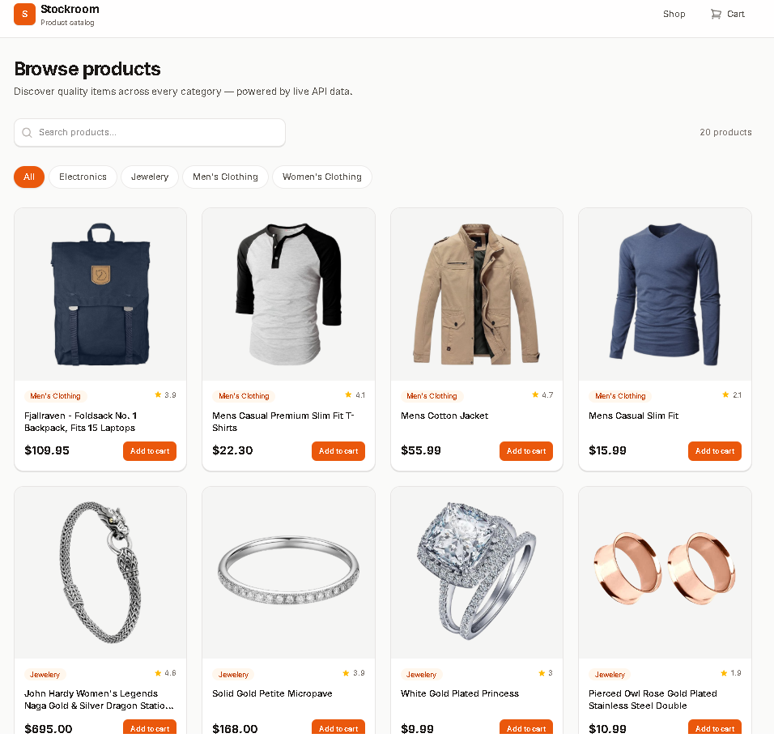
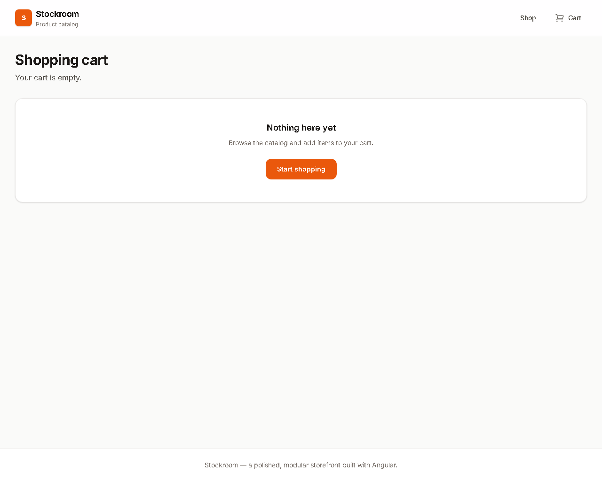

# Stockroom

Stockroom is a modern Angular storefront optimized for desktop and mobile shoppers.
It provides a lean catalog experience, a fully functional shopping cart, and a secure checkout flow with client-side validation.

## Screenshots





## What this app does

- Presents a searchable product catalog sourced from a remote API.
- Supports item details and quantity selection.
- Enables cart management with quantity adjustments, item removal, and local persistence.
- Performs checkout validation and shows a confirmation screen with order details.

## Core features

- Product catalog with live filtering and category navigation.
- Product detail page with image preview, pricing, and add-to-cart support.
- Cart page with editable quantities and a clear order summary.
- Checkout page with validated contact, shipping, and payment inputs.
- Order confirmation with generated order number and receipt-style summary.

## Tech stack

- Angular 22
- TypeScript 6
- Angular Signals for local component/service state
- Reactive Forms for checkout validation
- Tailwind CSS v4 for UI styling
- Vitest for unit testing

## Project structure

```
src/app/
├── core/                       # Domain models and singleton services
│   ├── models/
│   └── services/
├── features/                   # Feature modules and route views
│   ├── catalog/
│   ├── product-detail/
│   ├── cart/
│   └── checkout/
└── shared/                     # Shared UI components and common utilities
```

## Checkout behavior

- The cart page sends users to checkout only when items are present.
- The checkout form validates required fields and common payment formats.
- Order details are saved to session storage before navigation, so the confirmation page can recover if the browser is refreshed immediately after checkout.
- The confirmation page clears the cart and renders a summary for the current order.

## Setup

### Requirements

- Node.js 20 or newer
- npm 10 or newer

### Install

```bash
npm install
```

### Run locally

```bash
npm start
```

or with the Angular CLI:

```bash
ng serve
```

Open `http://localhost:4200/` in your browser.

### Build for production

```bash
npm run build
```

### Run tests

```bash
npm test
```

### Run end-to-end tests

```bash
ng e2e
```

## Code scaffolding

Angular CLI includes powerful code scaffolding tools. To generate a new component, run:

```bash
ng generate component component-name
```

For a complete list of available schematics, run:

```bash
ng generate --help
```

## Additional Resources

For more information on using the Angular CLI, including detailed command references, visit the [Angular CLI Overview and Command Reference](https://angular.dev/tools/cli) page.

## Notes

This repository focuses on clean architecture for a small storefront app. It uses Angular's feature modules and reusable shared components to keep the codebase maintainable while preserving a polished customer checkout experience.
